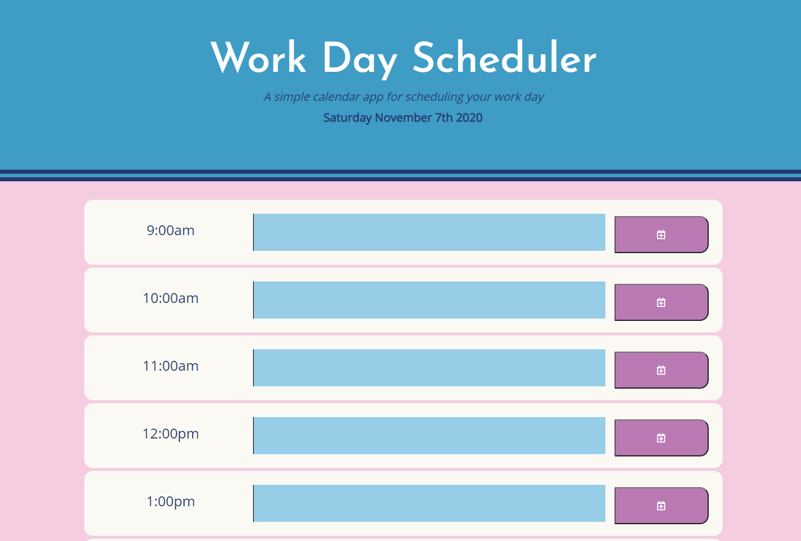

# Day Planner

This project aimed to create a simple calendar application that allows a user to save events for each hour of the day. The application features dynamically updated HTML and CSS powered by jQuery and also made use of JavaScript for loops to dynamically create the HTML elements onto the page.

This application makes use of the Moment.js API to set the day at the top of the page, and takes advantage of the API's ability to get the hour of the day so that each time-block is color coded to indicate whether it is for the past, present or future. This application also features the use of local storage in order to save the hourly user input to the schedule.

## Deployment
[Live Website](https://jonnahmarie.github.io/Day-Planner/)

## Screenshot

## Acknowledgements
I would not have been able to figure out setting and getting local storage on dynamically created elements if it were not for my brother-in-law, who works as a software developer. I was not able to set up tutor session in time and was lucky that he was able to help me work through my thought process on how exactly to execute my vision.

